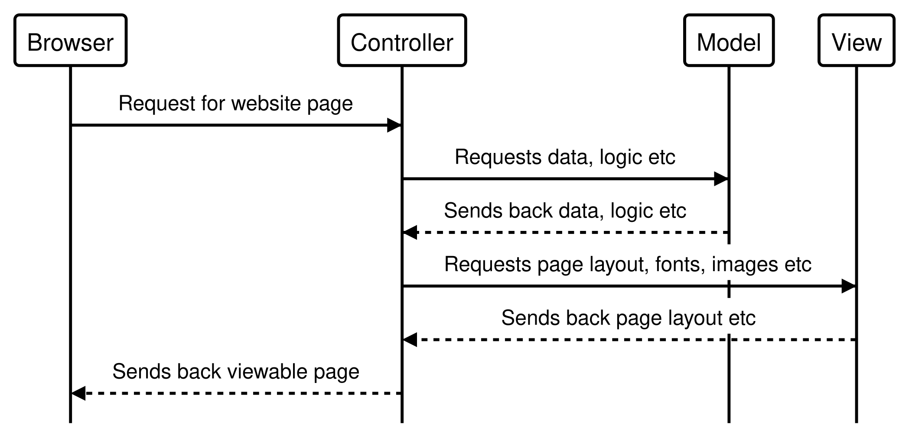

#### What is MVC?

MVC is Model-View-Controller and is a software design pattern that is commonly used to develop user interfaces.

Model - manages the data, logic and rules of an application.

View - is any representation of information, such as charts, as well as how the page is laid out, fonts used, etc.

Controller - accepts input and turns it into commands for model or view.

In essence the controller accepts input, manipulating it as necessary before passing it onto the model for the raw data. It then goes back to the controller who passes it to view for the layout etc before coming back to the controller as a viewable page.

Here is a sequence diagram to explain this:

